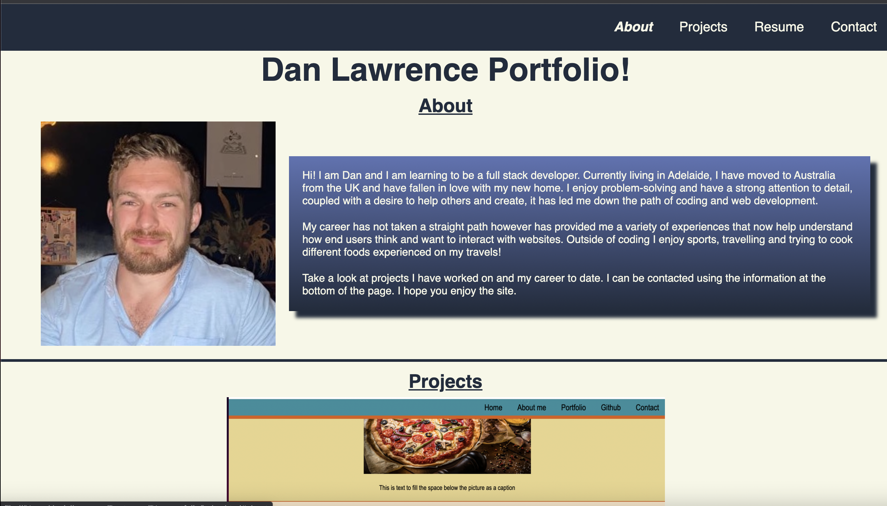
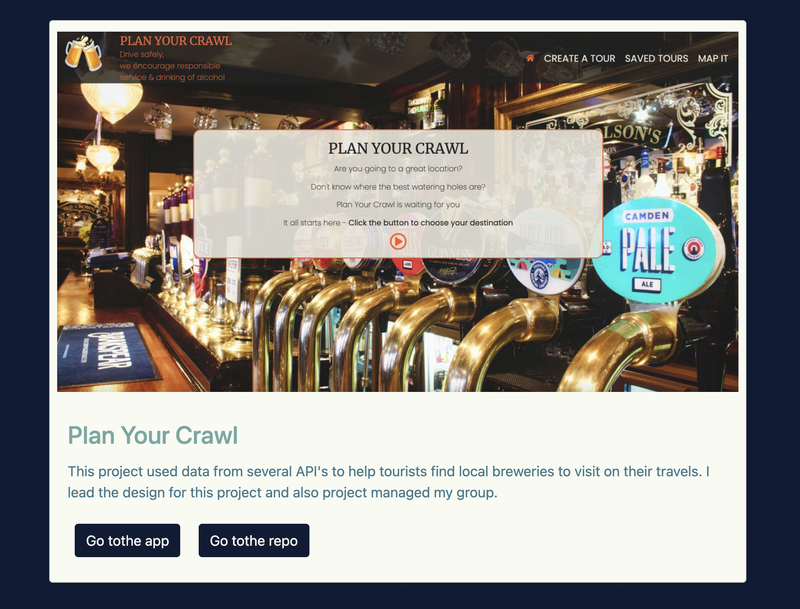

# DLs-portfolio

## Description

This is my portfolio website that includes contact information and an up to date resume, LinkedIn and Github profile.

I will constantly be updating this with my most recent work as it is completed.

## Portfolio and functionality

This portfolio has been put together using a combination of HTML, Bootstrap and custom CSS.

The fist screenshot shows the inital view of the page with header that is fixed:

This second screenshot shows how the projects are displayed:

## Technologies

A list of tecnologies used in this portfolio:

- HTML
- CSS
- Bootstrap
- JavaScript

## Links

A link is supplied to the [deployed project.](https://danlawrence91.github.io/DLs-portfolio/)

I can be contacted at the following email address - dan.lawrence0810@gmail.com
