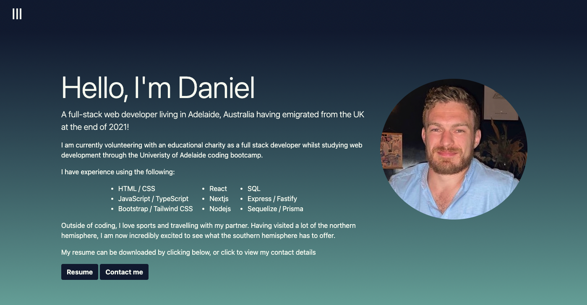

# DLs-portfolio

## Description
This is a repository for my personal portfolio which will contain the code to write it and the deployed web page.

This project was built to give me the basis of a professional portfolio that can continually be added to throughout my career once more projects are completed.

It will provide me with something to supply prospective employers to shoiwcase my skills and show why I would be a match for a potential role.

This helped me build upon CSS skills learned over the last week and further these skills.

The portfolio will include contact details and highlight recent, relevant work which can be used to evaluate my skills.

There will be a link to each project highlighted which will then open in a new tab, as well as links in the contact section that will open the relevant pages or an email to me.

## Portfolio and functionality

This protfolio has been put together using a combination of HTML, Bootstrap and custom CSS.

The fist screenshot shows the inital view of the page with header that is fixed:

This second screenshot shows how the projects are displayed:

This final screenshot shows resume and contact section with links to contact or download the resume:

A link is supplied to the [deployed project.](https://danlawrence91.github.io/DLs-portfolio/)

## Future features

I will continue to add to this project to improve both the layout and functionality as I learn more languages and have more in depth projects to use in place of those currently selected.

