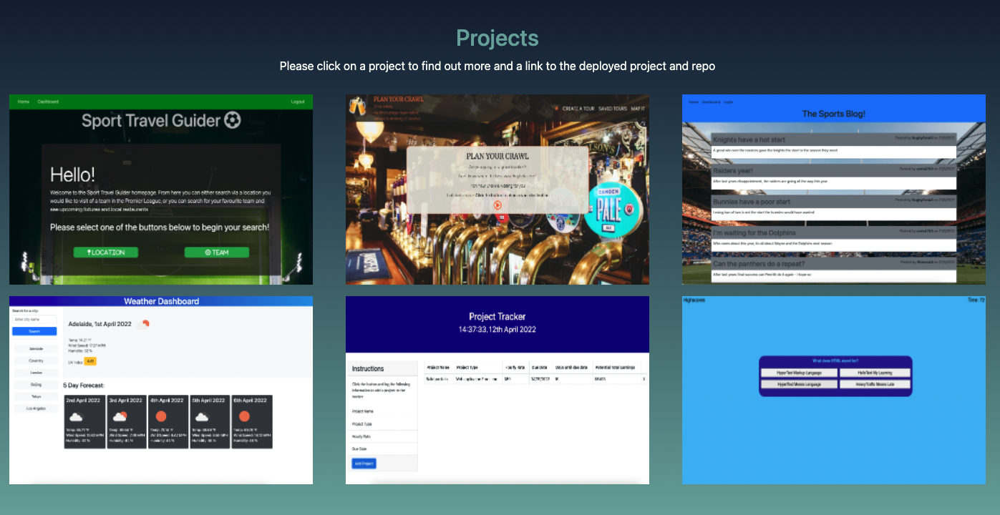

# DLs-portfolio

## Description
This is a repository for my personal portfolio which will contain the code to write it and the deployed web page.

This project was built to give me the basis of a professional portfolio that can continually be added to throughout my career once more projects are completed.

It will provide me with something to supply prospective employers to shoiwcase my skills and show why I would be a match for a potential role.

This helped me build upon CSS skills learned over the last week and further these skills.

The portfolio will include contact details and highlight recent, relevant work which can be used to evaluate my skills.

There will be a link to each project highlighted which will then open in a new tab, as well as links in the contact section that will open the relevant pages or an email to me.

## Portfolio and functionality

I have included some screenshots to show how the portfolio looks when opened and some of the functionality that has been added via CSS.

The fist shows the inital view and how the link hovered on the navigation bar changes in comparison to the others:

This second screenshot shows shadowing provided to the links to different projects that have been worked on to indicate which is going to be selected:

A link is supplied to the [deployed project](https://danlawrence91.github.io/DLs-portfolio/)

## Future features

I will continue to add to this project to improve both the layout and functionality as I learn more languages and have more in depth projects to use in place of those currently selected.

